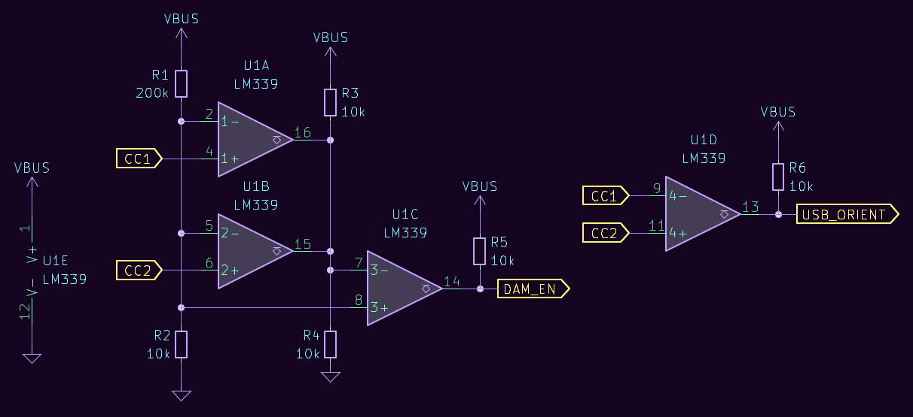
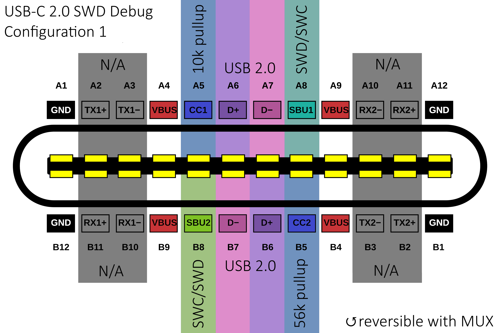
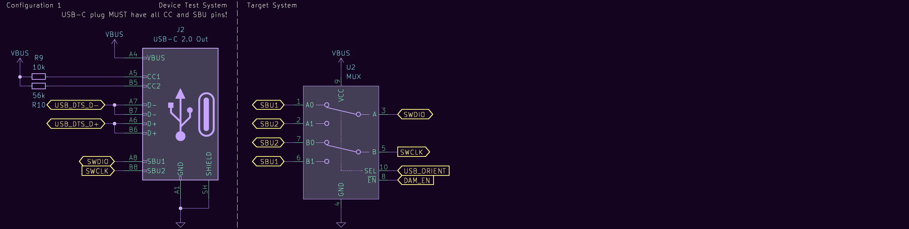
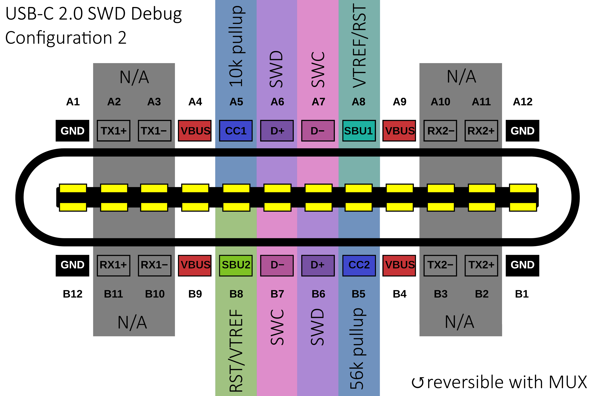
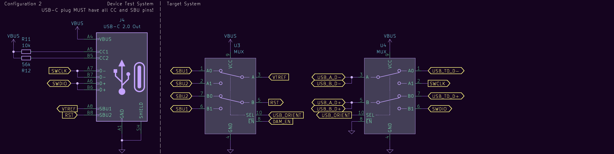
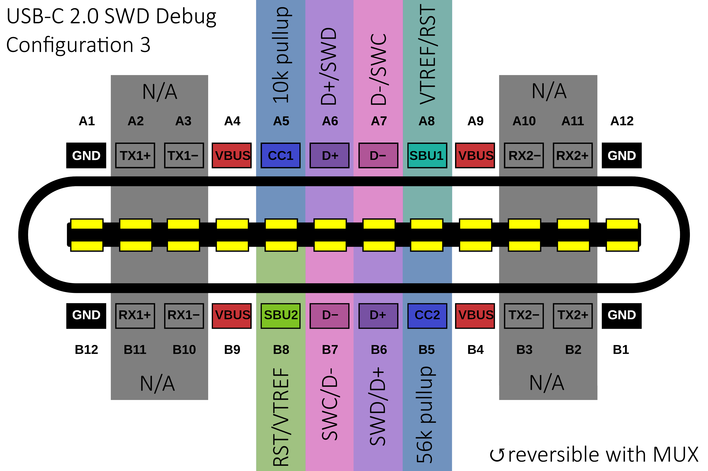
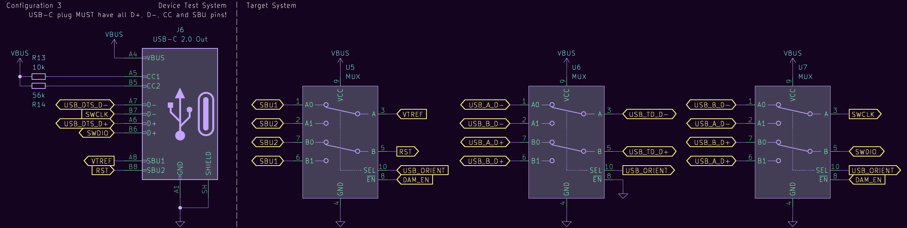
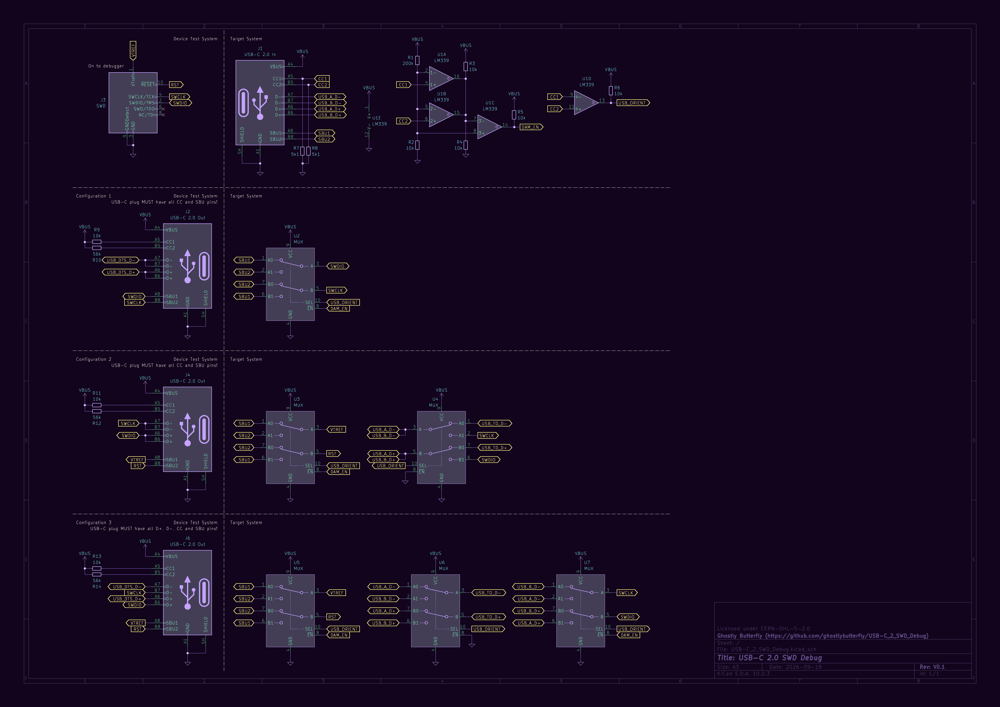

# USB-C 2.0 SWD Debug
This repository has been created to document my musings on creating a standardised method of performing SWD debugging with a USB-C 2.0 port through the use of [Debug Accessory Mode (DAM)](https://en.wikipedia.org/wiki/USB-C#Debug_Accessory_Mode) while maintaining full reversibility.

## Introduction
Although projects such as [SWD-over-USB-C](https://github.com/minoseigenheer/SWD-over-USB-C/) have already been developed to allow a USB-C 3.0 port to be used for SWD debugging through DAM, fully-featured 24p USB-C receptacles are expensive and difficult to solder. Because of this, I wanted to create an alternative compatible with much more common 14p/16p USB-C ones that are only capable of USB 2.0 connectivity.

I have yet to implement any of what is discussed here into an actual working project, and I'm just using this repository to document my thoughts on the matter after having had a productive conversation about this with [Saixos/nmunnich](https://github.com/nmunnich/) in the fingerpunch discord server. However, I will use this repository when I design something around the ideas I have documented here.

## TS DAM and orientation detection
Appendix B of the [USB-C specification](https://www.usb.org/sites/default/files/USB%20Type-C%20Spec%20R2.0%20-%20August%202019_0.pdf) dictates that a Device Test System (DTS) needs to simultaneously present two pullups (Rp) or pulldowns (Rd) on CC1/CC2 to signify to the Target System (TS) that it is required to enter DAM. A cable does not pass both CC wires, hence the DTS must be either a captive cable or a direct-attach device with a USB-C plug.

The TS can also perform orientation detection through the DTS presenting asymmetrical Rp or Rd values on CC1/CC2. This results in different voltages being present on the CC1 and CC2 pins such that the TS can determine the plug orientation by comparing which CC pin has the higher voltage. A MUX can then be used to route the signals to match the plug orientation.

In this case, the TS will almost certainly be a keyboard acting as a sink with 5k1 Rd resistors presented to the CC pins, so the DTS will be a source and present Rp on CC1/CC2. According to the specification, both Rp values must conform to USB-C source CC Rp termination requirements, with the available values shown in the below table taken straight from Table 4-24 of the USB-C specification.

| Source Advertisement | Resistor pull-up to 4.75 - 5.5 V |
| -------------------- | -------------------------------- |
| Default USB Power    | 56k                              |
| 1.5 A @ 5 V          | 22k                              |
| 3.0 A @ 5 V          | 10k                              |

In addition, on the DTS, CC2 should have the weaker resistive value, and on the TS, the CC pin with the lower voltage is used for source advertisement and the CC pin with the higher voltage is used to determine orientation. Subsequently, the following values are chosen, with these voltages being presented on CC1 and CC2 as a result.

| CC pin | Rp value | Presented voltage |
| ------ | -------- | ----------------- |
| CC1    | 10k      | ~1.69V             |
| CC2    | 56k      | ~0.42V             |

Presumably, the DTS does not need to supply more than 500mA of current, so Rp CC2 is set to 56k, and Rp CC1 is set to 10k to ensure a greater voltage range. A simple circuit consisting of four comparators and some resistors can be used to determine both that the TD needs to enter DAM, as well as the plug orientation. Only essential components are shown here.

U1A and U1B form an AND gate that outputs high when both CC1 and CC2 Rp values are present, which is then inverted by U1C to ensure that DAM_EN is low only when Rp resistors are present on both CC1/CC2. U1D simply outputs high when CC2 > CC1, indicating an orientation swap. R1 and R2 feed 0.24V into the inverting inputs of U1A and U1B which lets an Rp value of 56k be detected.

|  CC1  |  CC2  | DAM_EN | USB_ORIENT |
| ----- | ----- | ------ | ---------- |
|    X  |   0V  |      1 |          0 |
|   0V  |  >0V  |      1 |          1 |
| 1.69V | 0.42V |      0 |          0 |
| 0.42V | 1.69V |      0 |          1 |

## Debugger connections
Given that this is an SWD debugger, it is a given that at least two discrete wires are required to transmit SWD and SWC. RST is also very nice to have during the debugging process so as not to need to manually reset the MCU through a hardware reset when it gets stuck, and VTREF from the JTAG interface is also nice for compatibility with a greater range of debuggers and target devices. SWO is generally unneeded for debugging, so it is not connected here.

With that in mind, there are three possible TS configurations for connecting a debugging interface through a USB-C 2.0 receptacle to a DTS. They depend on whether RST and VTREF are utilised, and whether or not USB 2.0 connectivity is wanted on top of that. The more connectivity added, the more complicated the end system becomes as a result. 

(The following images of USB port pinout are modified from the image on [Wikipedia's USB-C page.](https://en.wikipedia.org/wiki/USB-C#/media/File:USB_Type-C_Receptacle_Pinout.svg))

### Configuration 1

This is the simplest configuration and only exposes the SWD and SWC pins to the DTS. Subsequently, it only requires one dual 2:1 MUX to switch in the debugging signals to the correct pins when DAM is enabled. As far as I know, this is USB compliant, as the SBU lines are left in high Z unless the TS is in DAM and the USB data lines are left untouched. As both SBU wires will be used, the plug used must have both present.

As simple as this configuration is, using the SBU lines to transmit data in this manner isn't ideal because there is a possibility for them to get shorted with the VBUS lines which may result in a fried MCU. Therefore, configurations 2 and 3 were created to try and deal with this issue, along with adding more debugging connectivity.

### Configuration 2

This configuration MUXes D+/D- out for SWD/SWC, and MUXes RST/VTREF into SBU1/SBU2 when DAM is entered. Therefore, there is no USB connectivity when a DTS is connected. As with configuration 1, the DTS plug used must have both SBU lines present, and it also requires an additional dual 2:1 MUX due to one of them needing to always be enabled. This can be either integrated into one IC or separate, but quad 2-channel 2:1 MUXes with separate ENs don't seem common.

### Configuration 3

When USB 2.0 connectivity is desired alongside RST and VTREF, this configuration can be used. It takes advantage of the spare D+/D- pair to MUX in SWD and SWC depending on the detected plug orientation while still connecting USB D+/D-, but of course, the DTS plug used must have both D+/D- pairs for this to work. It is also the most expensive and largest solution because it requires 3 2-channel 2:1 MUXes.

## Closing thoughts
The DTS can be something as simple as a breakout board with a USB-C plug, the Rp resistors, and an IDC header on it to connect it to a debugger such as an ST-link. This is also capable of being incredibly small, as the LM339B quad comparator comes in a 3.0x3.0mm WQFN-16 package, and dual 2:1 MUXes such as the TMUX1072 come in a 2.0x1.7mm UQFN-12 package. This makes configuration 1 especially attractive if a small, cheap solution is desirable.

On the other hand, if configuration 3 is used and the USB 2.0 connectivity is passed through, it is also possible to use a full-on MCU in a setup like the [Black Magic Probe](https://black-magic.org/) and even integrate a USB hub on to the DTS so that both the DTS and the TS can be simultaneously connected to a PC. One must weigh up whether it is worth it to increase the solution size and cost in order to add more debugging connectivity.

Overall, this is looking like a promising, relatively low-cost new debugging standard that doesn't necessitate the use of a full 24p USB-C receptacle on a device and which potentially also takes up a miniscule amount of space on the PCB. It shouldn't cost too much to implement onto keyboards or other devices which use the SWD debugging interface.

## Appendix
### Useful Links
- [USB-C specification](https://www.usb.org/sites/default/files/USB%20Type-C%20Spec%20R2.0%20-%20August%202019.pdf)
- [ARM JTAG/SWD interface](https://support.arm.com/documentation/101636/0100/Debug-and-Trace/JTAG-SWD-Interface)
- [SWD over USB-C](https://github.com/BitterAndReal/SWD-over-USB-C)
- [Black Magic Probe](https://black-magic.org/)

### Full configuration schematic

## Changelog
- 2026/09/18: Initial V0.1 commit.